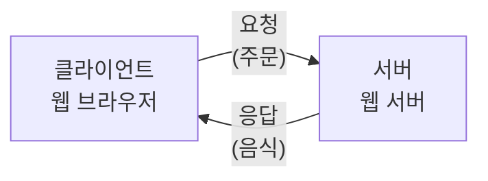
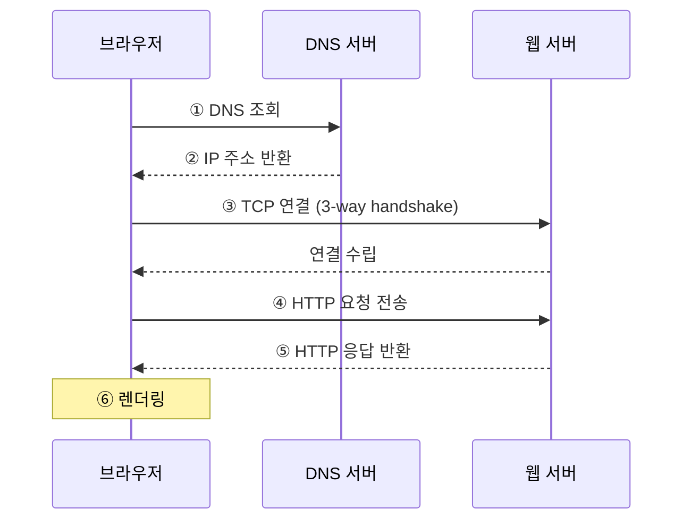
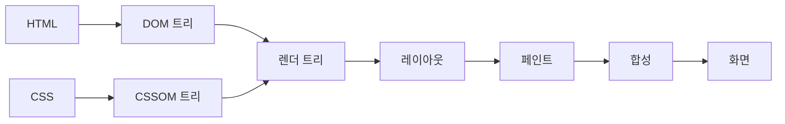
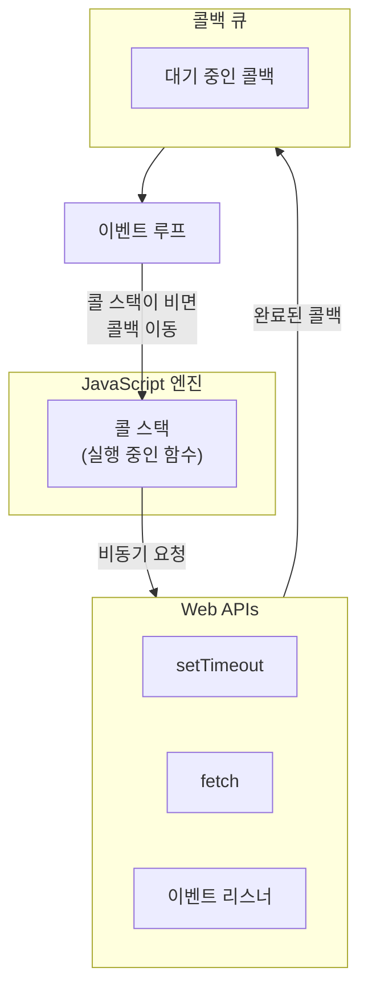

# 제1장: 웹이 동작하는 방식

---

## 학습 목표

이 장을 마치면 다음을 수행할 수 있다:
- 클라이언트-서버 아키텍처의 개념을 이해하고 설명할 수 있다
- HTTP 요청/응답의 흐름을 단계별로 설명할 수 있다
- 브라우저 렌더링 과정을 순서대로 나열할 수 있다
- DOM의 역할과 JavaScript 실행 환경을 이해할 수 있다
- DevTools를 활용하여 네트워크 요청과 DOM 구조를 분석할 수 있다

---

## 1.1 클라이언트-서버 아키텍처

### 웹은 어떻게 동작할까?

웹 브라우저에 주소를 입력하고 Enter를 누르면 화면에 웹페이지가 나타난다. 이 단순해 보이는 과정 뒤에는 어떤 일이 일어나는 것일까? 웹의 동작 원리를 이해하는 것은 웹 프로그래밍의 첫걸음이다. 에러가 발생했을 때 원인을 파악하고, 성능 문제를 해결하며, 효율적인 코드를 작성하려면 웹이 어떻게 동작하는지 알아야 한다.

웹은 **클라이언트-서버 아키텍처**(Client-Server Architecture)라는 구조로 동작한다. 이 구조를 이해하기 위해 익숙한 상황을 떠올려보자.

### 식당 비유로 이해하기

식당에서 음식을 주문하는 상황을 생각해보자. 손님은 메뉴판을 보고 원하는 음식을 주문하고, 주방에서는 주문을 받아 음식을 만들어 손님에게 제공한다. 이 과정에서 손님과 주방은 각자의 역할이 명확하게 분리되어 있다.

웹도 이와 같다. **클라이언트**(Client)는 손님처럼 서비스를 요청하는 측이고, **서버**(Server)는 주방처럼 요청을 처리하여 결과를 제공하는 측이다. 웹에서 클라이언트는 주로 웹 브라우저(Chrome, Safari, Firefox 등)를 의미하고, 서버는 웹 서버 프로그램(Apache, Nginx, Node.js 등)이 실행되는 컴퓨터를 의미한다.



**그림 1.1** 클라이언트-서버 아키텍처 기본 구조

### 클라이언트의 역할

클라이언트는 다음과 같은 역할을 담당한다. 첫째, 사용자의 입력을 받아 처리한다. 사용자가 URL을 입력하거나 버튼을 클릭하면 클라이언트가 이를 인식한다. 둘째, 서버에 요청을 전송한다. 사용자의 행동을 HTTP 요청으로 변환하여 서버로 보낸다. 셋째, 서버로부터 받은 응답을 화면에 표시한다. HTML, CSS, JavaScript를 해석하여 사용자가 볼 수 있는 웹페이지로 렌더링한다.

### 서버의 역할

서버는 다음과 같은 역할을 담당한다. 첫째, 클라이언트의 요청을 수신한다. 둘째, 요청을 분석하고 필요한 데이터를 준비한다. 이 과정에서 데이터베이스에 접근하거나 파일을 읽을 수 있다. 셋째, 처리 결과를 응답으로 반환한다. HTML 문서, JSON 데이터, 이미지 파일 등 다양한 형태로 응답할 수 있다.

### URL의 구조

서버에 요청을 보내려면 서버의 주소를 알아야 한다. 웹에서는 **URL**(Uniform Resource Locator)이라는 형식으로 주소를 표현한다. URL은 인터넷에서 리소스의 위치를 나타내는 표준 형식이다.

다음은 URL의 구성 요소이다.

```
https://www.example.com:443/products/list?sort=price#section1
└─┬──┘ └──────┬───────┘└┬─┘└─────┬─────┘└───┬────┘└───┬───┘
프로토콜    도메인    포트    경로       쿼리     프래그먼트
```

**표 1.1** URL 구성 요소

| 구성 요소 | 예시 | 설명 |
|-----------|------|------|
| 프로토콜 | https:// | 통신 규약 (http, https 등) |
| 도메인 | www.example.com | 서버의 주소 (IP의 별칭) |
| 포트 | :443 | 서버의 특정 서비스 입구 |
| 경로 | /products/list | 서버 내 리소스 위치 |
| 쿼리 문자열 | ?sort=price | 추가 파라미터 |
| 프래그먼트 | #section1 | 페이지 내 특정 위치 |

**도메인**(Domain)은 서버의 주소를 사람이 읽기 쉬운 형태로 표현한 것이다. 실제로 컴퓨터는 숫자로 된 IP 주소(예: 93.184.216.34)를 사용하지만, 사람이 기억하기 어려우므로 도메인이라는 별칭을 사용한다. 도메인을 IP 주소로 변환하는 시스템을 **DNS**(Domain Name System)라고 한다.

**포트**(Port)는 서버에서 실행 중인 여러 프로그램 중 어떤 프로그램에 연결할지를 지정한다. 아파트에서 동과 호수로 정확한 집을 찾는 것처럼, IP 주소가 건물(서버 컴퓨터)이라면 포트 번호는 호수(프로그램)에 해당한다. HTTP는 기본적으로 80번 포트를, HTTPS는 443번 포트를 사용하며, 기본 포트는 URL에서 생략할 수 있다.

---

## 1.2 HTTP 요청과 응답의 흐름

### HTTP란 무엇인가?

클라이언트와 서버가 데이터를 주고받으려면 서로 이해할 수 있는 약속된 형식이 필요하다. **HTTP**(HyperText Transfer Protocol)는 웹에서 데이터를 주고받기 위한 프로토콜, 즉 통신 규약이다. 편지를 주고받을 때 봉투에 보내는 사람과 받는 사람의 주소를 적는 것처럼, HTTP도 요청과 응답에 정해진 형식이 있다.

### HTTP 요청의 구조

클라이언트가 서버에 보내는 HTTP 요청은 크게 세 부분으로 구성된다. 요청 라인, 헤더, 바디이다.

```
GET /index.html HTTP/1.1          ← 요청 라인
Host: www.example.com             ← 헤더 시작
User-Agent: Mozilla/5.0
Accept: text/html
Accept-Language: ko-KR
                                  ← 빈 줄 (헤더 끝)
(요청 바디 - POST 등에서 사용)
```

**요청 라인**(Request Line)은 요청의 핵심 정보를 담고 있다. HTTP 메서드, 경로, HTTP 버전으로 구성된다. 위 예시에서 `GET`은 메서드, `/index.html`은 경로, `HTTP/1.1`은 버전이다.

**HTTP 메서드**(Method)는 서버에게 어떤 동작을 요청하는지 나타낸다. 가장 많이 사용되는 메서드는 GET과 POST이다.

**표 1.2** 주요 HTTP 메서드

| 메서드 | 용도 | 특징 |
|--------|------|------|
| GET | 리소스 조회 | 데이터를 가져올 때 사용. URL에 파라미터 포함 |
| POST | 리소스 생성 | 데이터를 서버에 보낼 때 사용. 바디에 데이터 포함 |
| PUT | 리소스 전체 수정 | 기존 리소스를 완전히 대체 |
| PATCH | 리소스 부분 수정 | 기존 리소스의 일부만 수정 |
| DELETE | 리소스 삭제 | 서버의 리소스 삭제 요청 |

**헤더**(Header)는 요청에 대한 부가 정보를 담는다. 편지 봉투에 적는 정보와 비슷하다. 어떤 브라우저에서 보냈는지(User-Agent), 어떤 형식의 응답을 원하는지(Accept), 어떤 언어를 선호하는지(Accept-Language) 등의 정보가 포함된다.

**바디**(Body)는 실제 전송할 데이터를 담는다. GET 요청은 보통 바디가 없고, POST 요청에서 폼 데이터나 JSON을 보낼 때 바디를 사용한다.

### HTTP 응답의 구조

서버가 클라이언트에게 보내는 HTTP 응답도 비슷한 구조를 가진다.

```
HTTP/1.1 200 OK                   ← 상태 라인
Content-Type: text/html           ← 헤더 시작
Content-Length: 1234
Date: Mon, 01 Jan 2026 00:00:00 GMT
                                  ← 빈 줄 (헤더 끝)
<!DOCTYPE html>                   ← 바디 시작
<html>
...
</html>
```

**상태 라인**(Status Line)은 HTTP 버전과 상태 코드, 상태 메시지로 구성된다. 상태 코드는 요청 처리 결과를 숫자로 나타낸다.

**표 1.3** 주요 HTTP 상태 코드

| 상태 코드 | 의미 | 설명 |
|-----------|------|------|
| 200 OK | 성공 | 요청이 정상적으로 처리됨 |
| 201 Created | 생성 성공 | 새 리소스가 성공적으로 생성됨 |
| 301 Moved Permanently | 영구 이동 | 리소스가 다른 URL로 영구 이동함 |
| 400 Bad Request | 잘못된 요청 | 요청 형식이 잘못됨 |
| 401 Unauthorized | 인증 필요 | 로그인이 필요함 |
| 403 Forbidden | 접근 금지 | 권한이 없음 |
| 404 Not Found | 찾을 수 없음 | 요청한 리소스가 존재하지 않음 |
| 500 Internal Server Error | 서버 오류 | 서버에서 오류 발생 |

상태 코드는 첫 번째 숫자에 따라 의미가 구분된다. 2xx는 성공, 3xx는 리다이렉션, 4xx는 클라이언트 오류, 5xx는 서버 오류를 나타낸다. 404 에러를 많이 접해봤을 텐데, 이는 요청한 페이지가 서버에 존재하지 않는다는 의미이다.

### 요청-응답 사이클

웹 브라우저에서 URL을 입력하면 다음과 같은 과정이 진행된다.



**그림 1.2** HTTP 요청-응답 흐름

첫째, 브라우저는 입력된 도메인의 IP 주소를 DNS 서버에 질의한다. 둘째, DNS 서버가 IP 주소를 반환하면, 브라우저는 해당 IP의 서버와 TCP 연결을 맺는다. 셋째, 연결이 수립되면 HTTP 요청을 전송한다. 넷째, 서버는 요청을 처리하고 HTTP 응답을 반환한다. 마지막으로, 브라우저는 받은 응답을 화면에 렌더링한다.

---

## 1.3 브라우저 렌더링 파이프라인

### 브라우저가 화면을 그리는 과정

서버로부터 HTML, CSS, JavaScript 파일을 받았다고 해서 바로 화면에 표시되는 것은 아니다. 브라우저는 이 파일들을 해석하고 처리하여 최종적으로 화면에 그려야 한다. 이 과정을 **렌더링**(Rendering)이라고 하며, 일련의 단계를 거치기 때문에 **렌더링 파이프라인**(Rendering Pipeline)이라고도 부른다.

렌더링 파이프라인을 이해하면 왜 어떤 웹사이트는 빠르고 어떤 웹사이트는 느린지 알 수 있다. 또한 성능 최적화를 위해 어떤 부분을 개선해야 하는지 파악할 수 있다.

### 렌더링 단계 개요



**그림 1.3** 브라우저 렌더링 파이프라인

### 1단계: HTML 파싱과 DOM 트리 생성

브라우저가 HTML 문서를 받으면 가장 먼저 **파싱**(Parsing) 작업을 수행한다. 파싱이란 텍스트 형태의 코드를 브라우저가 이해할 수 있는 구조로 변환하는 과정이다.

HTML을 파싱하면 **DOM 트리**(DOM Tree)가 생성된다. DOM은 Document Object Model의 약자로, 문서를 트리 형태의 객체 구조로 표현한 것이다. 트리 구조란 부모-자식 관계로 연결된 계층 구조를 말한다. 가계도를 생각하면 이해하기 쉽다.

다음 HTML 코드가 어떻게 DOM 트리로 변환되는지 살펴보자.

```html
<!DOCTYPE html>
<html>
  <head>
    <title>예제</title>
  </head>
  <body>
    <div id="container">
      <h1>제목</h1>
      <p>본문</p>
    </div>
  </body>
</html>
```

이 HTML은 다음과 같은 DOM 트리로 변환된다.

```
Document
└── html
    ├── head
    │   └── title
    │       └── "예제"
    └── body
        └── div#container
            ├── h1
            │   └── "제목"
            └── p
                └── "본문"
```

**그림 1.4** DOM 트리 예시

DOM과 HTML은 같아 보이지만 다르다. HTML은 텍스트 파일이고, DOM은 메모리에 있는 객체 트리이다. JavaScript는 이 DOM 객체를 조작하여 웹페이지의 내용을 동적으로 변경할 수 있다.

### 2단계: CSS 파싱과 CSSOM 트리 생성

HTML과 마찬가지로 CSS도 파싱 과정을 거쳐 **CSSOM 트리**(CSS Object Model Tree)로 변환된다. CSSOM은 각 요소에 어떤 스타일이 적용되는지 계산한 결과를 담고 있다.

### 3단계: 렌더 트리 생성

DOM 트리와 CSSOM 트리가 준비되면 이 둘을 결합하여 **렌더 트리**(Render Tree)를 생성한다. 렌더 트리는 실제로 화면에 표시될 요소만 포함한다. 예를 들어, `display: none`으로 설정된 요소는 렌더 트리에 포함되지 않는다.

### 4단계: 레이아웃 (Layout)

렌더 트리가 생성되면 각 요소의 정확한 위치와 크기를 계산하는 **레이아웃**(Layout) 단계가 진행된다. 이 단계에서 CSS의 width, height, margin, padding 등의 속성이 실제 픽셀 값으로 계산된다. 이 과정을 **리플로우**(Reflow)라고도 부른다.

레이아웃은 비용이 많이 드는 작업이다. 요소의 크기나 위치가 변경되면 그 요소뿐만 아니라 영향을 받는 다른 요소들도 다시 계산해야 하기 때문이다.

### 5단계: 페인트 (Paint)

레이아웃 계산이 완료되면 **페인트**(Paint) 단계에서 각 요소를 실제 픽셀로 그린다. 텍스트, 색상, 이미지, 테두리 등 시각적 요소가 이 단계에서 처리된다.

### 6단계: 합성 (Composite)

마지막으로 **합성**(Composite) 단계에서 여러 레이어를 결합하여 최종 화면을 만든다. 브라우저는 성능 최적화를 위해 일부 요소를 별도의 레이어로 분리하여 처리하는데, 합성 단계에서 이 레이어들을 올바른 순서로 쌓아 화면에 표시한다.

---

## 1.4 DOM과 JavaScript 런타임

### DOM이란 무엇인가?

앞에서 DOM 트리에 대해 간략히 살펴보았다. 이제 DOM에 대해 더 자세히 알아보자. **DOM**(Document Object Model)은 HTML 문서를 프로그래밍적으로 접근하고 조작할 수 있게 해주는 인터페이스이다.

DOM을 이해하기 위해 리모컨을 떠올려보자. TV를 직접 만질 수 없지만 리모컨을 통해 채널을 바꾸고 볼륨을 조절할 수 있다. DOM은 웹페이지를 조작하기 위한 리모컨과 같다. JavaScript는 DOM을 통해 웹페이지의 내용을 읽고, 수정하고, 새로운 요소를 추가하거나 삭제할 수 있다.

### DOM 조작의 기본

JavaScript로 DOM을 조작하는 기본적인 방법을 알아보자.

**요소 선택하기**

DOM 요소를 조작하려면 먼저 해당 요소를 선택해야 한다. JavaScript는 여러 가지 선택 방법을 제공한다.

```javascript
// ID로 선택 (단일 요소)
const header = document.getElementById('main-header');

// CSS 선택자로 선택 (첫 번째 일치 요소)
const button = document.querySelector('.submit-btn');

// CSS 선택자로 선택 (모든 일치 요소)
const items = document.querySelectorAll('.list-item');
```

_전체 코드는 practice/chapter1/code/1-4-dom-practice.js 참고_

`getElementById`는 ID로 요소를 선택하며, ID는 문서 내에서 고유해야 한다. `querySelector`는 CSS 선택자 문법을 사용하여 요소를 선택하며, 첫 번째 일치하는 요소만 반환한다. `querySelectorAll`은 일치하는 모든 요소를 NodeList로 반환한다.

**내용 변경하기**

선택한 요소의 내용을 변경하는 방법이다.

```javascript
// 텍스트 내용 변경
element.textContent = '새로운 텍스트';

// HTML 내용 변경
element.innerHTML = '<strong>굵은 텍스트</strong>';
```

`textContent`는 순수 텍스트만 처리하고, `innerHTML`은 HTML 태그를 해석하여 적용한다. `innerHTML`은 사용자 입력을 그대로 넣으면 보안 문제(XSS 공격)가 발생할 수 있으므로 주의해야 한다.

**이벤트 처리하기**

사용자의 행동(클릭, 입력 등)에 반응하려면 이벤트 리스너를 등록해야 한다.

```javascript
// 클릭 이벤트 리스너 등록
button.addEventListener('click', (event) => {
    console.log('버튼이 클릭되었습니다!');
});
```

`addEventListener` 메서드는 첫 번째 인자로 이벤트 유형, 두 번째 인자로 이벤트가 발생했을 때 실행할 함수를 받는다.

### JavaScript 런타임 환경

JavaScript가 브라우저에서 어떻게 실행되는지 이해하면 비동기 프로그래밍을 더 잘 이해할 수 있다.

JavaScript는 **단일 스레드**(Single Thread)로 실행된다. 이는 한 번에 하나의 작업만 처리할 수 있다는 의미이다. 그렇다면 시간이 오래 걸리는 작업이 있으면 웹페이지가 멈추는 것일까?

그렇지 않다. JavaScript는 **비동기**(Asynchronous) 처리를 통해 이 문제를 해결한다. 시간이 오래 걸리는 작업은 브라우저의 Web API에 맡기고, JavaScript는 다음 작업을 계속 처리한다. 작업이 완료되면 콜백 함수를 통해 결과를 받는다.

이 과정을 관리하는 것이 **이벤트 루프**(Event Loop)이다. 은행 창구를 생각해보자. 창구는 하나뿐이지만(단일 스레드), 고객은 번호표를 받고 대기한다(콜백 큐). 창구가 비면 다음 고객을 호출한다(이벤트 루프).



**그림 1.5** JavaScript 런타임 환경

---

## 1.5 DevTools 실습: 네트워크/요소/콘솔 탭 활용

### 실습 목표

이 실습에서는 Chrome DevTools를 활용하여 앞서 배운 개념들을 직접 확인해본다. 실습을 완료하면 다음을 수행할 수 있게 된다:
- DevTools를 열고 기본 인터페이스를 탐색할 수 있다
- Network 탭에서 HTTP 요청/응답을 분석할 수 있다
- Elements 탭에서 DOM 구조를 확인하고 수정할 수 있다
- Console 탭에서 JavaScript를 실행할 수 있다

### 실습 환경 준비

Chrome 브라우저를 열고 아무 웹사이트에 접속한다. 그 다음 DevTools를 연다.

- Windows/Linux: `F12` 또는 `Ctrl + Shift + I`
- macOS: `Cmd + Option + I`
- 또는 페이지에서 마우스 우클릭 → "검사" 선택

### 실습 1: Network 탭에서 HTTP 요청 분석

Network 탭은 웹페이지가 서버와 주고받는 모든 HTTP 요청을 보여준다.

**1단계: Network 탭 열기**

DevTools에서 "Network" 탭을 클릭한다. 처음에는 목록이 비어있을 수 있다.

**2단계: 요청 기록하기**

Network 탭이 열린 상태에서 페이지를 새로고침(F5)한다. 화면에 요청 목록이 나타난다.

**3단계: 요청 상세 정보 확인**

목록에서 첫 번째 요청(보통 HTML 문서)을 클릭하면 상세 정보 패널이 열린다.

- **Headers 탭**: 요청 헤더와 응답 헤더 확인
- **Preview 탭**: 응답 내용 미리보기
- **Response 탭**: 응답 원본 확인
- **Timing 탭**: 요청 처리 시간 분석

**확인할 내용**
- 요청 메서드가 GET인지 확인
- 응답 상태 코드가 200인지 확인
- Content-Type 헤더가 text/html인지 확인

### 실습 2: Elements 탭에서 DOM 탐색

Elements 탭은 현재 페이지의 DOM 트리를 보여준다.

**1단계: Elements 탭 열기**

DevTools에서 "Elements" 탭을 클릭한다.

**2단계: 요소 선택하기**

왼쪽 상단의 선택 도구(화살표 아이콘)를 클릭하거나 `Ctrl/Cmd + Shift + C`를 누른다. 그 다음 페이지에서 원하는 요소를 클릭하면 해당 요소가 DOM 트리에서 하이라이트된다.

**3단계: 실시간 수정 테스트**

DOM 트리에서 텍스트를 더블클릭하면 직접 수정할 수 있다. 수정한 내용은 페이지에 즉시 반영된다. 단, 이는 임시 변경이며 새로고침하면 원래대로 돌아간다.

**4단계: CSS 스타일 확인**

요소를 선택하면 오른쪽 패널에서 해당 요소에 적용된 CSS 스타일을 확인할 수 있다. 스타일 값을 클릭하여 실시간으로 수정해볼 수 있다.

### 실습 3: Console 탭에서 JavaScript 실행

Console 탭은 JavaScript 명령을 직접 실행하고 결과를 확인할 수 있는 공간이다.

**1단계: Console 탭 열기**

DevTools에서 "Console" 탭을 클릭한다.

**2단계: 간단한 명령 실행**

다음 명령어들을 입력하고 Enter를 눌러 실행해본다.

```javascript
// 페이지 제목 확인
document.title

// 첫 번째 h1 요소 선택
document.querySelector('h1')

// 페이지의 모든 링크 개수 확인
document.querySelectorAll('a').length

// 배경색 변경 (임시)
document.body.style.backgroundColor = 'lightblue'
```

**3단계: DOM 조작 실습**

```javascript
// 새 요소 생성
const newDiv = document.createElement('div');
newDiv.textContent = 'DevTools에서 추가한 요소';
newDiv.style.padding = '10px';
newDiv.style.backgroundColor = 'yellow';

// 페이지에 추가
document.body.appendChild(newDiv);
```

위 코드를 실행하면 페이지 맨 아래에 노란색 배경의 새 요소가 추가된다.

### 실습 결과 확인

실습을 통해 다음을 확인했다:
- Network 탭에서 HTTP 요청/응답 구조를 직접 볼 수 있다
- Elements 탭에서 DOM 트리 구조를 확인하고 실시간 수정이 가능하다
- Console 탭에서 JavaScript를 실행하여 DOM을 조작할 수 있다

_추가 실습 파일은 practice/chapter1/code/1-4-dom-practice.html 참고_

---

## 핵심 정리

이 장에서 다룬 핵심 내용을 정리하면 다음과 같다:

- **클라이언트-서버 아키텍처**: 웹은 서비스를 요청하는 클라이언트(브라우저)와 응답하는 서버로 구성된다
- **HTTP 프로토콜**: 웹에서 데이터를 주고받는 규약으로, 요청과 응답 구조를 정의한다
- **상태 코드**: 200은 성공, 404는 찾을 수 없음, 500은 서버 오류를 의미한다
- **렌더링 파이프라인**: HTML 파싱 → DOM 트리 → 렌더 트리 → 레이아웃 → 페인트 순서로 화면을 그린다
- **DOM**: HTML 문서를 객체 트리로 표현한 것으로, JavaScript로 조작할 수 있다
- **DevTools**: 웹 개발자의 필수 도구로, 네트워크 분석, DOM 탐색, JavaScript 실행이 가능하다

---

## 연습문제

### 기초

**1.** 클라이언트-서버 아키텍처에서 다음 역할을 하는 것은 무엇인가?
   - 서비스를 요청하는 측: ( )
   - 서비스를 제공하는 측: ( )

**2.** 다음 URL에서 각 부분을 식별하시오.
   `https://shop.example.com:443/products/item?id=123#reviews`
   - 프로토콜: ( )
   - 도메인: ( )
   - 포트: ( )
   - 경로: ( )
   - 쿼리 문자열: ( )

**3.** 다음 HTTP 상태 코드의 의미를 설명하시오.
   - 200: ( )
   - 404: ( )
   - 500: ( )

### 중급

**4.** DevTools의 Network 탭을 열고 아무 웹사이트를 새로고침한 후, 다음을 확인하여 기록하시오.
   - 첫 번째 요청의 HTTP 메서드: ( )
   - 응답 상태 코드: ( )
   - Content-Type 헤더 값: ( )

**5.** DevTools Console에서 다음 JavaScript 코드를 실행하고 결과를 설명하시오.
   ```javascript
   document.querySelectorAll('a').length
   ```

**6.** 브라우저 렌더링 파이프라인의 단계를 올바른 순서로 나열하시오.
   (보기: 페인트, DOM 트리 생성, 레이아웃, 렌더 트리 생성, 합성)

### 심화

**7.** 다음 상황에서 발생할 수 있는 성능 문제와 그 이유를 설명하시오.
   ```javascript
   for (let i = 0; i < 1000; i++) {
       document.body.style.width = i + 'px';
   }
   ```

---

## 다음 장 예고

다음 장에서는 AI 코딩 도구 활용법을 배운다. 이 장에서 배운 웹 기초 지식을 바탕으로, AI 도구를 효과적으로 활용하여 웹 개발을 하는 방법을 익힐 것이다. 특히 AI 도구의 버전 불일치 문제와 이를 해결하는 전략을 중점적으로 다룬다.

---

## 참고문헌

1. MDN Web Docs. (2025). How the Web works. https://developer.mozilla.org/en-US/docs/Learn/Getting_started_with_the_web/How_the_Web_works
2. MDN Web Docs. (2025). HTTP 개요. https://developer.mozilla.org/ko/docs/Web/HTTP/Overview
3. Google Developers. (2025). Critical Rendering Path. https://developers.google.com/web/fundamentals/performance/critical-rendering-path
4. MDN Web Docs. (2025). Document Object Model (DOM). https://developer.mozilla.org/en-US/docs/Web/API/Document_Object_Model
5. Chrome DevTools Documentation. (2025). https://developer.chrome.com/docs/devtools/
