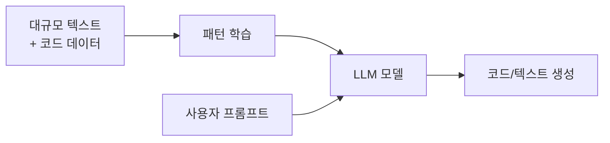
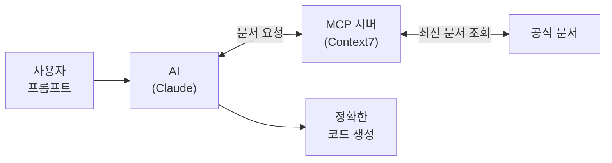
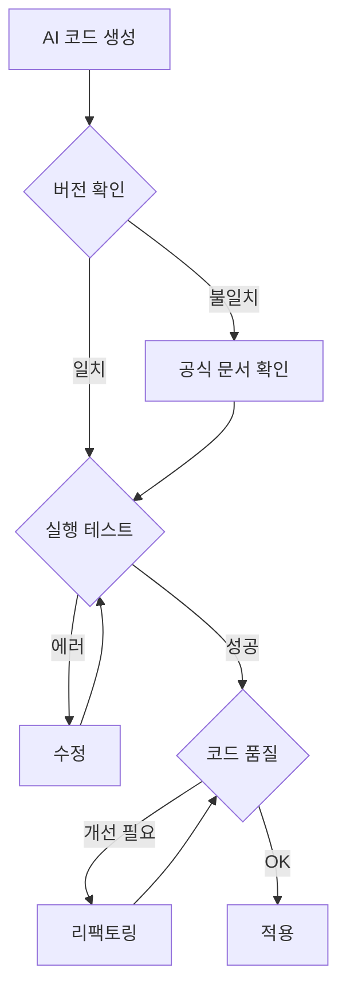

# 제2장: AI 코딩 도구 활용법

---

## 학습 목표

이 장을 마치면 다음을 수행할 수 있다:
- AI 코딩 도구의 특성과 한계를 이해하고 설명할 수 있다
- AI 도구의 버전 불일치 문제를 인식하고 해결 전략을 적용할 수 있다
- 버전 명시 프롬프팅과 Context7 MCP를 활용할 수 있다
- AI 출력을 검증하는 프로세스를 수행할 수 있다
- GitHub Copilot을 효과적으로 설정하고 활용할 수 있다

---

## 2.1 AI 코딩 도구의 특성과 한계

### AI 코딩 도구를 왜 배워야 할까?

AI 코딩 도구는 개발자의 생산성을 크게 높여주는 강력한 도구이다. 코드 자동완성, 버그 수정 제안, 코드 설명 등 다양한 기능을 제공한다. 그러나 이 도구를 효과적으로 활용하려면 그 특성과 한계를 정확히 이해해야 한다. AI가 생성한 코드를 무조건 신뢰하면 오히려 시간을 낭비하거나 버그를 만들 수 있기 때문이다.

이 절에서는 AI 코딩 도구가 어떻게 동작하는지 알아보고, 반드시 알아야 할 한계점을 살펴본다.

### AI 코딩 도구란?

**AI 코딩 도구**는 인공지능을 활용하여 코드 작성을 도와주는 소프트웨어이다. 대표적인 도구로는 GitHub Copilot, ChatGPT, Claude, Cursor 등이 있다. 이 도구들은 모두 **LLM**(Large Language Model, 대규모 언어 모델)이라는 기술을 기반으로 한다.

**표 2.1** 주요 AI 코딩 도구 비교

| 도구 | 개발사 | 주요 특징 | 가격 |
|------|--------|----------|------|
| GitHub Copilot | GitHub (Microsoft) | VS Code 통합, 코드 자동완성 | 월 $10 (학생 무료) |
| ChatGPT | OpenAI | 대화형 인터페이스, 코드 설명 | 무료/Plus $20 |
| Claude | Anthropic | 긴 컨텍스트, 상세한 분석 | 무료/Pro $20 |
| Cursor | Cursor | AI 네이티브 에디터 | 무료/Pro $20 |

### LLM의 동작 원리

LLM이 어떻게 코드를 생성하는지 이해하면 AI 도구를 더 효과적으로 활용할 수 있다. LLM을 "책을 엄청 많이 읽은 조수"라고 생각해보자. 이 조수는 수많은 책(학습 데이터)을 읽어서 패턴을 익혔다. 질문을 하면 학습한 패턴을 바탕으로 가장 그럴듯한 답변을 생성한다.



**그림 2.1** LLM 동작 원리 개요

중요한 점은 LLM이 코드를 "이해"하는 것이 아니라 "패턴을 매칭"한다는 것이다. 따라서 학습 데이터에 없는 최신 정보는 알지 못하고, 때로는 그럴듯하지만 틀린 답변을 생성하기도 한다.

### AI 코딩 도구의 한계

AI 코딩 도구를 사용할 때 반드시 알아야 할 네 가지 한계가 있다.

**첫째, 학습 데이터 cutoff 문제이다.** LLM은 특정 시점까지의 데이터로 학습된다. 이를 **학습 cutoff**(knowledge cutoff)라고 한다. 예를 들어, 2023년 12월까지의 데이터로 학습된 모델은 2024년에 출시된 라이브러리 버전을 알지 못한다. 이는 AI가 구버전 API를 추천하는 주요 원인이다.

**둘째, 할루시네이션(Hallucination) 현상이다.** AI가 존재하지 않는 정보를 마치 사실인 것처럼 자신있게 생성하는 현상을 할루시네이션이라고 한다. 없는 함수명, 잘못된 파라미터, 가상의 라이브러리를 제안하는 경우가 이에 해당한다. 마치 "자신있게 틀린 답을 하는 학생"과 같다.

**셋째, 컨텍스트 제한이 있다.** LLM은 한 번에 처리할 수 있는 텍스트 양에 제한이 있다. GPT-4는 약 128,000 토큰, Claude는 약 200,000 토큰까지 처리할 수 있다. 대규모 프로젝트의 전체 코드를 한꺼번에 이해하기 어렵다는 의미이다.

**넷째, 보안 취약점 생성 가능성이 있다.** 연구에 따르면 AI가 생성한 코드의 상당 부분에 보안 취약점이 포함될 수 있다. SQL 인젝션, XSS 등의 보안 문제를 자동으로 생성할 수 있으므로 주의가 필요하다.

### 효과적인 활용을 위한 마인드셋

AI 코딩 도구는 "대체"가 아닌 "조수"로 활용해야 한다. 최종 결정과 검증은 항상 개발자의 몫이다. 다음 절에서는 가장 흔한 문제인 버전 불일치 문제와 그 해결 전략을 자세히 알아본다.

---

## 2.2 버전 불일치 문제의 이해

### AI가 추천한 코드에서 에러가 나는 이유

AI 도구를 사용하다 보면 추천받은 코드가 에러를 발생시키는 경우를 자주 경험한다. 가장 흔한 원인은 **버전 불일치** 문제이다. AI가 학습한 시점의 라이브러리 버전과 현재 사용 중인 버전이 다르기 때문에 발생한다.

작년 지도를 들고 새로 생긴 건물을 찾는 상황을 상상해보자. 지도에는 없는 건물이니 당연히 찾을 수 없다. AI도 마찬가지이다. 학습 이후에 변경된 API는 알지 못한다.

### LLM 학습 시점과 라이브러리 버전 차이

각 AI 도구는 특정 시점까지의 데이터로 학습된다. 이 시점을 **학습 cutoff**라고 한다.

**표 2.2** 주요 AI 도구의 학습 cutoff (2026년 기준 추정)

| AI 도구 | 학습 cutoff | 비고 |
|---------|------------|------|
| GPT-4 | 2023년 12월 | 정기적 업데이트 |
| Claude 3.5 | 2024년 4월 | 모델별 상이 |
| Copilot | 지속적 업데이트 | GitHub 코드 기반 |

문제는 프론트엔드 라이브러리들이 빠르게 업데이트된다는 점이다. React, Supabase, Next.js 등은 1-2년 사이에 큰 변화가 있었다.

**주요 라이브러리 버전 변화 사례**

React는 2022년 3월 버전 18을 출시하면서 `createRoot` API를 도입했다. 기존의 `ReactDOM.render()`는 deprecated되었다. AI가 구버전 문법을 제안하면 deprecated 경고가 발생한다.

Supabase JS는 버전 1에서 버전 2로 업그레이드되면서 인증 API가 크게 변경되었다. `auth.signIn()`이 `auth.signInWithPassword()`로 변경되는 등 메서드명 자체가 바뀌었다.

### 발생 가능한 오류 유형

버전 불일치로 인해 발생하는 대표적인 오류 유형을 살펴보자.

**1. Import 경로 오류**

라이브러리의 내부 구조가 변경되면 import 경로도 달라진다.

```javascript
// ❌ 구버전 (에러 발생)
import { createClient } from '@supabase/supabase-js/dist/main/index'

// ✅ 현재 버전
import { createClient } from '@supabase/supabase-js'
```

**2. API 메서드 오류**

메서드명이나 시그니처가 변경된 경우이다.

```javascript
// ❌ Supabase v1 (현재 동작 안 함)
const { user, error } = await supabase.auth.signIn({
  email: 'user@example.com',
  password: 'password'
})

// ✅ Supabase v2 (현재 올바른 방법)
const { data, error } = await supabase.auth.signInWithPassword({
  email: 'user@example.com',
  password: 'password'
})
```

**3. Deprecated 경고**

코드가 실행은 되지만 콘솔에 경고 메시지가 표시된다.

```javascript
// ❌ React 17 방식 (deprecated in React 18)
import ReactDOM from 'react-dom'
ReactDOM.render(<App />, document.getElementById('root'))

// ✅ React 18 방식
import ReactDOM from 'react-dom/client'
const root = ReactDOM.createRoot(document.getElementById('root'))
root.render(<App />)
```

### 어떻게 알아차릴 수 있을까?

버전 불일치 문제를 인식하는 방법은 다음과 같다. 첫째, 에러 메시지에 "not a function", "undefined" 등이 포함되어 있다면 API 변경을 의심해볼 수 있다. 둘째, 콘솔에 deprecated 경고가 표시된다. 셋째, 공식 문서의 예제 코드와 AI가 생성한 코드가 다르다.

다음 절에서는 이 문제를 해결하는 첫 번째 전략인 버전 명시 프롬프팅을 알아본다.

---

## 2.3 해결 전략 1: 버전 명시 프롬프팅

### 가장 간단하고 효과적인 해결책

버전 불일치 문제를 해결하는 가장 간단한 방법은 **프롬프트에 버전 정보를 명시**하는 것이다. AI에게 "React 18을 사용한다"고 알려주면, AI는 해당 버전에 맞는 코드를 생성하려고 노력한다.

이는 식당에서 주문할 때와 비슷하다. "파스타 주세요"라고 하면 어떤 파스타가 나올지 모르지만, "토마토 소스 스파게티, 면은 알덴테로 해주세요"라고 구체적으로 말하면 원하는 음식을 받을 확률이 높아진다.

### 프롬프트에 버전 정보 포함하기

효과적인 프롬프트의 핵심 요소는 다음과 같다.

```
## 프로젝트 환경
- React: 18.2.x
- Supabase JS: v2.x
- Next.js: 14.x (App Router 사용)

## 코딩 규칙
- 함수형 컴포넌트만 사용
- async/await 패턴 사용

## 요청
Supabase v2의 signInWithOAuth를 사용해서 Google 로그인을 구현해주세요.
```

이렇게 버전을 명시하면 AI가 올바른 API를 사용할 확률이 크게 높아진다.

**좋은 프롬프트 vs 나쁜 프롬프트 비교**

**표 2.3** 프롬프트 품질 비교

| 나쁜 프롬프트 | 좋은 프롬프트 |
|--------------|--------------|
| "React로 로그인 폼 만들어줘" | "React 18.2, Supabase v2 환경에서 signInWithPassword로 이메일 로그인을 구현해주세요" |
| "Supabase 인증 코드 줘" | "Supabase JS v2.39를 사용합니다. OAuth로 Google 로그인하는 코드를 작성해주세요" |

### package.json 기반 컨텍스트 제공

프로젝트의 `package.json` 파일을 프롬프트에 포함하면 더 정확한 결과를 얻을 수 있다.

```
다음은 내 프로젝트의 package.json입니다:

{
  "dependencies": {
    "react": "^18.2.0",
    "@supabase/supabase-js": "^2.39.0",
    "next": "^14.0.0"
  }
}

위 버전에 맞는 코드로 사용자 인증 기능을 구현해주세요.
```

_프롬프트 템플릿 전체는 practice/chapter2/code/2-3-prompt-templates.md 참고_

### 프롬프트 작성 체크리스트

프롬프트를 작성할 때 다음 항목을 확인한다.

- [ ] 사용 중인 라이브러리 버전을 명시했는가?
- [ ] 코딩 컨벤션(함수형 vs 클래스형 등)을 명시했는가?
- [ ] 금지 사항(deprecated API 등)을 명시했는가?
- [ ] 요청이 구체적인가?

버전 명시 프롬프팅은 간단하지만 효과적이다. 그러나 매번 버전 정보를 입력하는 것이 번거로울 수 있다. 다음 절에서는 AI가 최신 문서를 직접 참조하게 하는 더 진보된 방법을 알아본다.

---

## 2.4 해결 전략 2: Context7 MCP 활용

### AI가 최신 문서를 직접 참조하게 하려면?

버전 명시 프롬프팅의 한계는 AI가 여전히 학습된 지식에 의존한다는 점이다. 학습 cutoff 이후에 완전히 새로 추가된 기능은 아무리 버전을 명시해도 정확한 답을 얻기 어렵다.

이 문제를 근본적으로 해결하는 방법이 있다. AI가 **최신 공식 문서를 직접 참조**하게 하는 것이다. 이를 가능하게 하는 기술이 **MCP**(Model Context Protocol)이다.

### MCP(Model Context Protocol) 개념

**MCP**는 AI 모델에 외부 데이터 소스를 연결하는 오픈 프로토콜이다. Anthropic이 2024년에 발표했으며, Claude Desktop, Cursor 등에서 지원한다.

MCP를 사용하면 AI가 실시간으로 외부 데이터를 조회할 수 있다. 마치 "AI에게 인터넷 검색 능력을 부여"하는 것과 같다.



**그림 2.2** MCP 아키텍처 개요

### Context7 설치 및 설정

**Context7**은 주요 라이브러리의 최신 공식 문서를 AI에 제공하는 MCP 서버이다. React, Next.js, Supabase, Tailwind 등 다양한 문서를 지원한다.

**설치 방법 (Claude Desktop 기준)**

1단계: Claude Desktop을 설치한다 (https://claude.ai/download).

2단계: 설정 파일을 편집한다. macOS의 경우 다음 경로에 있다.
```
~/Library/Application Support/Claude/claude_desktop_config.json
```

3단계: 다음 내용을 추가한다.
```json
{
  "mcpServers": {
    "context7": {
      "command": "npx",
      "args": ["-y", "@upstash/context7-mcp"]
    }
  }
}
```

4단계: Claude Desktop을 재시작한다.

### 최신 문서 참조 워크플로우

Context7이 설정되면 Claude에게 최신 문서를 참조하도록 요청할 수 있다.

**사용 예시**

```
Context7을 사용해서 Supabase v2의 signInWithOAuth 메서드 사용법을
알려줘. 공식 문서를 참조해서 정확한 코드를 작성해줘.
```

이렇게 요청하면 Claude가 Context7을 통해 Supabase의 최신 공식 문서를 조회하고, 그 내용을 바탕으로 정확한 코드를 생성한다.

**워크플로우 요약**

1. Context7 설치 및 설정
2. 프롬프트에 "Context7 사용" 또는 "공식 문서 참조" 명시
3. AI가 최신 문서를 조회하여 응답 생성
4. 생성된 코드 검증 (여전히 필요!)

MCP를 활용하면 버전 불일치 문제를 크게 완화할 수 있다. 그러나 AI의 출력을 완전히 신뢰해서는 안 된다. 다음 절에서는 AI 출력을 체계적으로 검증하는 프로세스를 알아본다.

---

## 2.5 AI 출력 검증 프로세스

### 왜 검증이 필요한가?

AI 코딩 도구가 아무리 발전해도 출력을 검증하는 과정은 생략할 수 없다. 할루시네이션, 버전 불일치, 보안 취약점 등의 문제가 여전히 발생할 수 있기 때문이다.

검증하지 않고 AI 코드를 사용하면 다음과 같은 문제가 발생할 수 있다. 런타임 에러로 앱이 동작하지 않거나, 보안 취약점이 프로덕션에 배포되거나, 기술 부채가 누적되어 유지보수가 어려워진다. 무엇보다 AI에만 의존하면 스스로 학습할 기회를 잃게 된다.

### 공식 문서와 대조 검증

AI 출력을 검증할 때 가장 먼저 확인해야 할 것은 **공식 문서**이다. 공식 문서는 "진실의 원천"(source of truth)이다.

**검증 우선순위**

1. **공식 문서** (최우선): 가장 정확하고 최신 정보
2. **GitHub 이슈/릴리즈 노트**: 버전별 변경사항, 알려진 버그
3. **Stack Overflow**: 답변 날짜와 투표 수 확인 필수
4. **블로그/튜토리얼**: 작성 날짜와 사용 버전 확인

**검증 예시**

AI가 다음 코드를 생성했다고 가정하자.

```javascript
const { data, error } = await supabase.auth.signInWithOAuth({
  provider: 'google',
})
```

이 코드가 올바른지 확인하려면 Supabase 공식 문서(https://supabase.com/docs)에서 `signInWithOAuth`를 검색하여 메서드 시그니처와 사용법을 대조한다.

### AI 사용 로그 작성법

AI 도구를 사용할 때마다 **로그를 작성**하는 습관을 들이면 좋다. 로그는 다음과 같은 목적으로 활용된다.

- **학습**: 어떤 프롬프트가 효과적이었는지 파악
- **디버깅**: 문제 발생 시 원인 추적
- **평가**: AI 도구의 정확도 측정

**AI 사용 로그 템플릿**

```markdown
## 세션 정보
- 날짜: 2026-01-01
- AI 도구: ChatGPT
- 작업: Google 로그인 구현

## 프롬프트
[사용한 프롬프트]

## AI 응답 요약
- [핵심 코드]

## 검증 결과
- [x] 공식 문서 대조
- [x] 실행 테스트

## 수정 사항
- 원본: [AI 코드]
- 수정: [최종 코드]
- 이유: [수정 이유]
```

_전체 템플릿은 practice/chapter2/code/2-5-ai-usage-log-template.md 참고_

### 검증 체크리스트 템플릿

체계적인 검증을 위해 체크리스트를 활용한다.

**표 2.4** AI 코드 검증 체크리스트

| 카테고리 | 확인 항목 |
|---------|----------|
| 버전 호환성 | import 경로, API 메서드, deprecated 여부 |
| 실행 테스트 | 컴파일 성공, 런타임 에러 없음, 예상 동작 |
| 코드 품질 | 네이밍 규칙, 불필요한 코드, 중복 |
| 보안 | 입력 검증, XSS 방지, 민감 정보 노출 |

_전체 체크리스트는 practice/chapter2/code/2-5-verification-checklist.md 참고_



**그림 2.3** AI 출력 검증 플로우

---

## 2.6 GitHub Copilot 활용법

### GitHub Copilot 소개

**GitHub Copilot**은 가장 널리 사용되는 AI 코딩 도구이다. VS Code에 통합되어 코드 작성 중 실시간으로 제안을 받을 수 있다. 이 절에서는 Copilot을 효과적으로 설정하고 활용하는 방법을 상세히 알아본다.

### VS Code 설치 및 설정

**1단계: Copilot 확장 설치**

VS Code 마켓플레이스에서 "GitHub Copilot"을 검색하여 설치한다. "GitHub Copilot Chat"도 함께 설치하면 대화형 기능을 사용할 수 있다.

**2단계: GitHub 계정 연동**

VS Code에서 GitHub 계정으로 로그인한다. Copilot 구독이 필요하다.

**3단계: 학생 무료 이용**

학생은 GitHub Education을 통해 무료로 Copilot을 사용할 수 있다.

1. https://education.github.com 접속
2. 학교 이메일 또는 학생증으로 인증
3. GitHub Student Developer Pack 승인
4. Copilot 자동 활성화

### copilot-instructions.md 작성

프로젝트에 `.github/copilot-instructions.md` 파일을 생성하면 Copilot이 프로젝트 컨텍스트를 인식한다. 이 파일에 버전 정보와 코딩 규칙을 명시하면 더 정확한 제안을 받을 수 있다.

```markdown
# Project Context

## Tech Stack
- React 18.2.x
- Supabase JS v2.x
- Vite 5.x

## Coding Conventions
- 함수형 컴포넌트만 사용
- async/await 패턴 사용

## 금지 사항
- class 컴포넌트 금지
- var 키워드 금지
```

_전체 템플릿은 practice/chapter2/code/2-6-copilot-instructions-template.md 참고_

### 효과적인 제안 유도 패턴

Copilot에서 좋은 제안을 받으려면 적절한 컨텍스트를 제공해야 한다.

**패턴 1: 함수 시그니처 먼저 작성**

함수명과 파라미터를 먼저 작성하면 Copilot이 의도를 파악하기 쉽다.

```javascript
// ❌ 빈 함수에서 시작
function handleSubmit() {
  // Copilot이 맥락 없이 추측
}

// ✅ 시그니처와 JSDoc으로 의도 명시
/**
 * 로그인 폼 제출 처리
 * @param {string} email
 * @param {string} password
 */
async function handleLogin(email, password) {
  // Copilot이 정확한 코드 제안
}
```

**패턴 2: 주석으로 의도 설명**

```javascript
// Supabase v2를 사용해서 Google OAuth 로그인 구현
async function signInWithGoogle() {
  // Copilot이 올바른 버전의 코드 제안
}
```

**패턴 3: 예제 패턴 제공**

```javascript
// 에러 처리 패턴:
// try { await supabase... } catch (e) { setError(e.message) }

async function fetchPosts() {
  // Copilot이 위 패턴을 따라 생성
}
```

### Copilot Chat 활용

Copilot Chat은 대화형으로 코드에 대해 질문하고 도움을 받을 수 있는 기능이다.

**표 2.5** Copilot Chat 주요 명령어

| 명령어 | 용도 | 예시 |
|--------|------|------|
| @workspace | 프로젝트 전체 참조 | @workspace Supabase 설정 위치 |
| /explain | 코드 설명 | /explain 이 함수 설명해줘 |
| /fix | 에러 수정 | /fix 이 에러 해결해줘 |
| /tests | 테스트 생성 | /tests 이 함수 테스트 |
| /doc | 문서화 | /doc JSDoc 추가해줘 |

**활용 예시**

```
@workspace 현재 프로젝트에서 Supabase 클라이언트가 어디에 설정되어 있어?

/explain 이 useEffect가 왜 무한 루프를 발생시키는지 설명해줘

/fix "Cannot read property 'map' of undefined" 에러 해결해줘
```

### Copilot 단축키

**표 2.6** Copilot 주요 단축키

| 단축키 | 기능 |
|--------|------|
| Tab | 제안 수락 |
| Esc | 제안 거부 |
| Alt + ] | 다음 제안 보기 |
| Alt + [ | 이전 제안 보기 |
| Ctrl + Enter | 여러 제안 패널 |
| Ctrl + I | 인라인 Chat |

### 제안 코드 검증 워크플로우

Copilot 제안을 수락하기 전에 항상 검증 과정을 거쳐야 한다.


**그림 2.4** Copilot 활용 워크플로우

**체크리스트**

Copilot 제안 수락 전 확인:
- [ ] import 경로가 프로젝트 구조와 일치하는가?
- [ ] 사용된 API가 현재 버전과 맞는가?
- [ ] deprecated 경고가 발생하지 않는가?
- [ ] 실제로 실행해서 동작을 확인했는가?

---

## 핵심 정리

이 장에서 다룬 핵심 내용을 정리하면 다음과 같다:

- **AI 코딩 도구의 한계**: 학습 cutoff, 할루시네이션, 컨텍스트 제한, 보안 취약점
- **버전 불일치 문제**: AI 학습 시점과 현재 라이브러리 버전의 차이로 발생
- **해결 전략 1**: 프롬프트에 버전 정보를 명시하여 정확한 코드 유도
- **해결 전략 2**: MCP(Context7)를 활용하여 AI가 최신 문서를 직접 참조
- **검증 프로세스**: 공식 문서 대조, AI 사용 로그 작성, 체크리스트 활용
- **Copilot 활용**: copilot-instructions.md 작성, 효과적인 제안 유도 패턴, Chat 명령어

---

## 연습문제

### 기초

**1.** AI 코딩 도구의 한계 3가지를 설명하시오.

**2.** 버전 불일치 문제란 무엇이며, 왜 발생하는지 설명하시오.

**3.** 다음 프롬프트의 문제점을 찾고 개선하시오.
   ```
   React로 로그인 폼 만들어줘
   ```

### 중급

**4.** 자신의 프로젝트에 맞는 버전 명시 프롬프트 템플릿을 작성하시오.

**5.** `.github/copilot-instructions.md` 파일을 작성하시오. 다음 환경을 가정한다:
   - React 18.2
   - Supabase JS v2
   - TypeScript 사용

**6.** 다음 AI 생성 코드를 공식 문서와 대조하여 검증하시오.
   ```javascript
   const { user, error } = await supabase.auth.signIn({
     email: 'test@example.com',
     password: 'password'
   })
   ```

### 심화

**7.** Context7 MCP를 설치하고, Claude Desktop에서 Supabase 최신 문서를 참조하여 OAuth 로그인 코드를 생성해보시오. 생성된 코드와 직접 작성한 프롬프트, 검증 결과를 AI 사용 로그 형식으로 기록하시오.

---

## 다음 장 예고

다음 장에서는 HTML 시맨틱과 접근성을 배운다. 이 장에서 익힌 AI 도구 활용법을 적용하여 올바른 HTML 구조를 작성하는 실습을 진행할 것이다. AI에게 "접근성을 고려한 로그인 폼을 만들어줘"라고 요청할 때, 어떤 컨텍스트를 제공해야 하는지도 함께 알아본다.

---

## 참고문헌

1. OpenAI. (2023). GPT-4 Technical Report. https://openai.com/research/gpt-4
2. GitHub. (2025). GitHub Copilot Documentation. https://docs.github.com/en/copilot
3. Anthropic. (2024). Model Context Protocol. https://docs.anthropic.com/mcp
4. Pearce, H., et al. (2021). Asleep at the Keyboard? Assessing the Security of GitHub Copilot's Code Contributions. arXiv:2108.09293
5. Supabase. (2025). Supabase JavaScript Client Documentation. https://supabase.com/docs/reference/javascript
