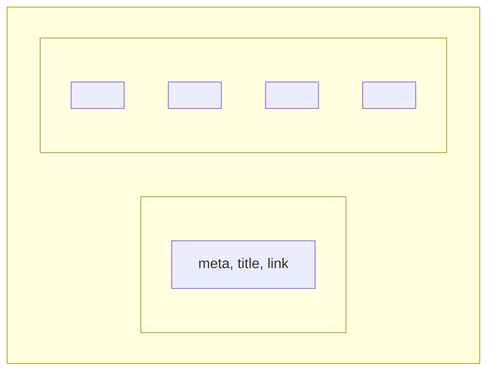
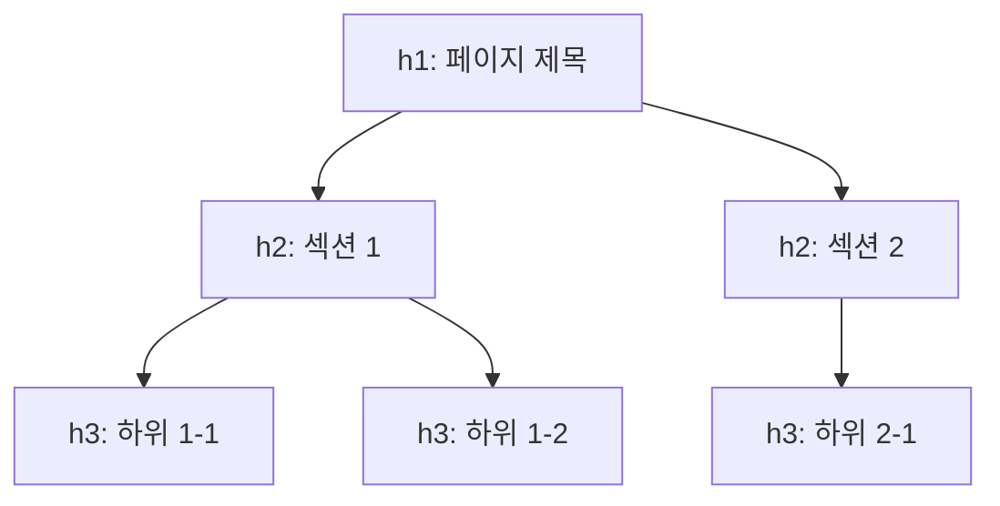
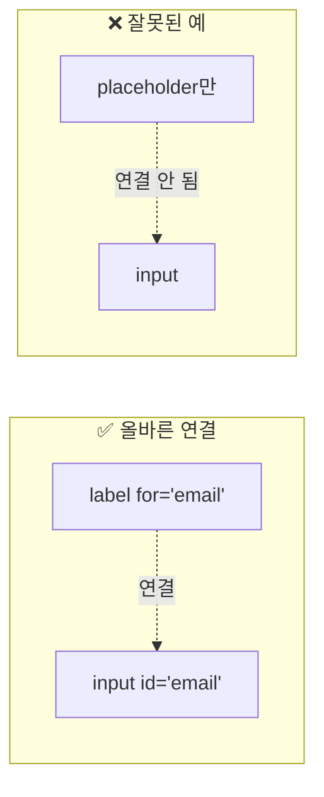
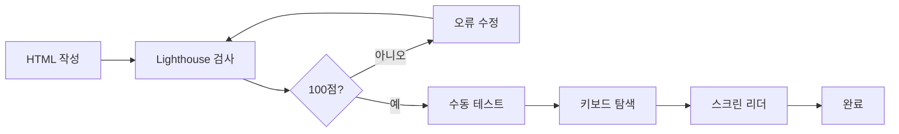

# 제3장: HTML 시맨틱과 접근성

---

## 학습 목표

이 장을 마치면 다음을 수행할 수 있다:
- HTML5 문서의 기본 구조를 설명하고 작성할 수 있다
- 시맨틱 태그의 의미를 이해하고 적절히 활용할 수 있다
- 폼 요소를 올바르게 마크업하고 레이블을 연결할 수 있다
- 웹 접근성의 기본 원칙을 이해하고 적용할 수 있다
- 접근성 검사 도구를 사용하여 문제를 발견하고 수정할 수 있다

---

## 3.1 HTML5 문서 구조

### HTML이 중요한 이유

HTML은 웹 페이지의 뼈대이다. 아무리 화려한 CSS와 강력한 JavaScript를 사용해도 HTML 구조가 잘못되면 검색 엔진이 페이지를 이해하지 못하고, 스크린 리더 사용자는 페이지를 탐색할 수 없다. 이 절에서는 올바른 HTML5 문서 구조를 배운다.

### HTML5 문서의 기본 틀

모든 HTML5 문서는 다음과 같은 기본 구조를 가진다.

```html
<!DOCTYPE html>
<html lang="ko">
<head>
    <meta charset="UTF-8">
    <meta name="viewport" content="width=device-width, initial-scale=1.0">
    <title>페이지 제목</title>
</head>
<body>
    <!-- 콘텐츠 -->
</body>
</html>
```

각 요소의 역할을 살펴보자.

**DOCTYPE 선언**: `<!DOCTYPE html>`은 이 문서가 HTML5임을 브라우저에 알린다. 이 선언이 없으면 브라우저가 호환 모드로 렌더링하여 예상치 못한 결과가 나올 수 있다.

**html 요소**: 문서의 최상위 요소이다. `lang="ko"` 속성은 문서의 주 언어가 한국어임을 명시한다. 스크린 리더는 이 속성을 보고 한국어 음성으로 읽는다.

**head 영역**: 문서의 메타데이터를 담는다. 브라우저 화면에는 보이지 않지만 매우 중요하다.

**body 영역**: 실제 사용자에게 보이는 콘텐츠가 들어간다.

### head 영역의 필수 요소

**표 3.1** head 영역 필수 요소

| 요소 | 역할 | 예시 |
|------|------|------|
| `<meta charset>` | 문자 인코딩 지정 | `<meta charset="UTF-8">` |
| `<meta viewport>` | 모바일 뷰포트 설정 | `width=device-width, initial-scale=1.0` |
| `<title>` | 페이지 제목 | 브라우저 탭, 검색 결과에 표시 |
| `<link>` | 외부 리소스 연결 | CSS 파일, 파비콘 |

`charset="UTF-8"`은 한글을 포함한 전 세계 문자를 올바르게 표시하기 위해 필수이다. 이 설정이 없으면 한글이 깨져 보일 수 있다.

`viewport` 메타 태그는 모바일 기기에서 페이지가 올바르게 표시되도록 한다. 이 설정이 없으면 모바일에서 페이지가 너무 작게 보인다.

### body 영역과 시맨틱 구조

body 안에는 시맨틱 태그를 사용하여 콘텐츠를 구조화한다. 다음 절에서 자세히 알아본다.



**그림 3.1** HTML5 문서 기본 구조

---

## 3.2 시맨틱 태그의 의미와 활용

### 시맨틱 마크업이란?

**시맨틱 마크업**(Semantic Markup)은 콘텐츠의 의미를 담은 태그를 사용하는 것이다. 예를 들어 내비게이션 메뉴를 `<div class="nav">`가 아닌 `<nav>`로 작성하는 것이다.

쉽게 말해서 태그 이름만 봐도 그 안에 무엇이 있는지 알 수 있도록 마크업하는 것이다. `<div>`는 "나눔"이라는 뜻일 뿐 어떤 콘텐츠인지 알 수 없지만, `<nav>`는 "내비게이션"임을 바로 알 수 있다.

### 왜 시맨틱 태그가 중요한가?

시맨틱 태그를 사용해야 하는 세 가지 이유가 있다.

**첫째, 접근성이 향상된다.** 스크린 리더는 시맨틱 태그를 인식하여 사용자에게 페이지 구조를 안내한다. "메인 콘텐츠로 이동", "내비게이션 영역" 등을 자동으로 알려준다.

**둘째, SEO가 개선된다.** 검색 엔진은 시맨틱 태그를 통해 페이지의 중요한 부분을 파악한다. `<main>` 안의 콘텐츠가 가장 중요하다는 것을 알 수 있다.

**셋째, 유지보수가 쉬워진다.** 코드만 봐도 구조를 이해할 수 있어 협업과 유지보수가 편해진다.

### 3.2.1 주요 시맨틱 태그

HTML5에서 제공하는 주요 시맨틱 태그를 알아보자.

**표 3.2** 주요 시맨틱 태그

| 태그 | 역할 | 사용 시점 |
|------|------|----------|
| `<header>` | 소개/내비게이션 콘텐츠 | 페이지/섹션 상단 (로고, 메뉴) |
| `<nav>` | 내비게이션 링크 | 메인 메뉴, 사이트 링크 그룹 |
| `<main>` | 페이지 주요 콘텐츠 | **페이지당 1개만** 사용 |
| `<section>` | 주제별 콘텐츠 그룹 | heading이 있는 영역 |
| `<article>` | 독립적 콘텐츠 | 블로그 글, 뉴스 기사, 댓글 |
| `<aside>` | 보조 콘텐츠 | 사이드바, 광고, 관련 링크 |
| `<footer>` | 바닥글 콘텐츠 | 저작권, 연락처, 사이트맵 |

**header**: 페이지나 섹션의 소개 부분이다. 로고, 검색창, 로그인 버튼 등이 들어간다. 페이지에 여러 개 있을 수 있다(페이지 header, article 내 header 등).

**nav**: 내비게이션 링크의 집합이다. 모든 링크에 nav를 쓰는 것이 아니라 주요 내비게이션 블록에만 사용한다.

**main**: 페이지의 핵심 콘텐츠이다. **페이지당 반드시 1개만** 사용해야 한다. header, nav, footer, aside는 main 바깥에 위치한다.

**section**: 주제별로 묶인 콘텐츠 그룹이다. 보통 heading(h2~h6)을 포함한다. 단순히 스타일링을 위한 그룹에는 div를 사용한다.

**article**: 독립적으로 배포하거나 재사용할 수 있는 콘텐츠이다. 블로그 포스트, 뉴스 기사, 사용자 댓글 등이 해당한다.

**aside**: 본문과 관련은 있지만 분리해도 되는 부가 콘텐츠이다. 사이드바, 광고, 관련 글 목록 등에 사용한다.

**footer**: 페이지나 섹션의 마무리 부분이다. 저작권 정보, 연락처, 관련 링크 등이 들어간다.

```html
<!-- 시맨틱 구조 예시 -->
<header>
    <h1>웹 프로그래밍 블로그</h1>
    <nav>
        <a href="/">홈</a>
        <a href="/posts">글목록</a>
    </nav>
</header>

<main>
    <article>
        <h2>React 시작하기</h2>
        <p>React는 UI 라이브러리입니다...</p>
    </article>
</main>

<aside>
    <h3>인기글</h3>
    <ul>...</ul>
</aside>

<footer>
    <p>© 2026 블로그</p>
</footer>
```

### 3.2.2 올바른 heading 계층 구조

heading 태그(h1~h6)는 문서의 개요를 형성한다. 올바른 계층 구조가 중요하다.

**규칙 1: h1은 페이지당 1개**

h1은 페이지의 주 제목이다. 검색 엔진과 스크린 리더가 가장 먼저 확인한다.

**규칙 2: 레벨을 건너뛰지 않는다**

h1 다음에 바로 h3이 오면 안 된다. h1 → h2 → h3 순서를 지킨다.

```html
<!-- ❌ 잘못된 예 -->
<h1>제목</h1>
<h3>소제목</h3>  <!-- h2를 건너뜀 -->

<!-- ✅ 올바른 예 -->
<h1>제목</h1>
<h2>소제목</h2>
<h3>세부 제목</h3>
```

**규칙 3: 스타일이 아닌 구조로 선택**

글씨를 크게 하고 싶다고 h1을 쓰면 안 된다. 스타일은 CSS로 조절하고, 태그는 의미에 맞게 선택한다.



**그림 3.2** heading 계층 구조 예시

---

## 3.3 폼 요소와 레이블링

### 웹 폼의 중요성

폼은 사용자와 웹사이트가 상호작용하는 핵심 수단이다. 로그인, 회원가입, 검색, 결제 등 거의 모든 기능에 폼이 사용된다. 폼이 접근 가능하지 않으면 많은 사용자가 서비스를 이용할 수 없다.

### 3.3.1 주요 폼 요소

**표 3.3** 주요 input type

| type | 용도 | 특징 |
|------|------|------|
| `text` | 일반 텍스트 | 기본값 |
| `email` | 이메일 주소 | 형식 자동 검증 |
| `password` | 비밀번호 | 입력 내용 숨김 |
| `number` | 숫자 | 증감 버튼 표시 |
| `tel` | 전화번호 | 모바일에서 숫자 키패드 |
| `checkbox` | 다중 선택 | 여러 개 선택 가능 |
| `radio` | 단일 선택 | 그룹 중 하나만 선택 |
| `submit` | 제출 버튼 | 폼 전송 |

**select**: 드롭다운 목록을 제공한다.

```html
<label for="city">도시 선택:</label>
<select id="city" name="city">
    <option value="">선택하세요</option>
    <option value="seoul">서울</option>
    <option value="busan">부산</option>
</select>
```

**textarea**: 여러 줄의 텍스트를 입력받는다.

```html
<label for="message">메시지:</label>
<textarea id="message" name="message" rows="5"></textarea>
```

**button**: 버튼을 만든다. type 속성으로 동작을 지정한다.

```html
<button type="submit">제출</button>
<button type="reset">초기화</button>
<button type="button">일반 버튼</button>
```

### 3.3.2 label과 for 속성의 중요성

**label은 필수이다.** 모든 폼 요소에는 그 목적을 설명하는 label이 있어야 한다. label이 없으면 스크린 리더 사용자는 무엇을 입력해야 하는지 알 수 없다.

**명시적 연결 (권장)**

`for` 속성과 `id` 속성으로 label과 input을 연결한다.

```html
<label for="email">이메일 주소</label>
<input type="email" id="email" name="email">
```

이 방법의 장점은 label을 클릭해도 input에 포커스가 이동한다는 것이다. 작은 체크박스나 라디오 버튼을 클릭하기 쉬워진다.

**암시적 연결**

input을 label 안에 넣는 방법도 있다.

```html
<label>
    이메일 주소
    <input type="email" name="email">
</label>
```

**placeholder는 label이 아니다**

placeholder는 입력 예시를 보여주는 용도이지 label을 대체할 수 없다.

```html
<!-- ❌ 잘못된 예 -->
<input type="email" placeholder="이메일을 입력하세요">

<!-- ✅ 올바른 예 -->
<label for="email">이메일</label>
<input type="email" id="email" placeholder="example@email.com">
```

placeholder만 있으면 스크린 리더가 읽지 못하고, 입력을 시작하면 힌트가 사라져 사용자가 혼란스러워진다.



**그림 3.3** 레이블 연결 방식 비교

---

## 3.4 웹 접근성 기초

### 웹 접근성이란?

**웹 접근성**(Web Accessibility)은 장애 여부와 관계없이 모든 사람이 웹을 이용할 수 있도록 하는 것이다. 시각장애인, 청각장애인, 운동장애인, 인지장애인 등 다양한 사용자를 고려해야 한다.

접근성은 특별한 사람들만을 위한 것이 아니다. 손목을 다쳐 마우스를 못 쓰는 사람, 밝은 햇빛 아래서 화면을 보는 사람, 시끄러운 환경에서 동영상을 보는 사람 모두 접근성의 혜택을 받는다.

### WCAG 가이드라인

**WCAG**(Web Content Accessibility Guidelines)는 W3C에서 제정한 웹 접근성 국제 표준이다. 현재 WCAG 2.2가 최신 버전이다(2023년 10월 발행).

WCAG는 네 가지 원칙(POUR)을 기반으로 한다.

**표 3.4** WCAG POUR 원칙

| 원칙 | 영문 | 의미 |
|------|------|------|
| 인식성 | Perceivable | 정보를 인식할 수 있어야 함 |
| 운용성 | Operable | UI를 조작할 수 있어야 함 |
| 이해성 | Understandable | 정보와 UI가 이해 가능해야 함 |
| 견고성 | Robust | 다양한 기술에서 호환되어야 함 |

준수 레벨은 A(최소), AA(표준), AAA(최고)로 나뉜다. 법적으로는 AA 레벨을 요구하는 경우가 많다.

### 3.4.1 키보드 내비게이션

마우스를 사용할 수 없는 사용자는 키보드만으로 웹사이트를 탐색한다. 모든 기능이 키보드로 접근 가능해야 한다.

**Tab 키**: 다음 포커스 가능한 요소로 이동
**Shift + Tab**: 이전 요소로 이동
**Enter/Space**: 버튼 클릭, 링크 이동
**화살표 키**: 라디오 버튼, 드롭다운 내 이동

**포커스 스타일은 제거하지 마라**

많은 개발자가 기본 포커스 스타일(파란 테두리)이 예쁘지 않다고 제거한다. 하지만 이는 키보드 사용자가 현재 위치를 알 수 없게 만든다.

```css
/* ❌ 잘못된 예 */
*:focus {
    outline: none;
}

/* ✅ 올바른 예: 커스텀 포커스 스타일 */
:focus {
    outline: 2px solid #007bff;
    outline-offset: 2px;
}
```

**tabindex 속성**

`tabindex`는 포커스 순서를 제어한다.

- `tabindex="0"`: 자연스러운 순서에 포함
- `tabindex="-1"`: 탭으로 이동 불가, JavaScript로만 포커스
- `tabindex="1"` 이상: 사용 지양 (순서 혼란)

### 3.4.2 ARIA 속성 기본

**ARIA**(Accessible Rich Internet Applications)는 HTML만으로 표현하기 어려운 접근성 정보를 제공하는 속성이다.

**ARIA 첫 번째 규칙**: 네이티브 HTML로 가능하면 ARIA를 쓰지 마라.

`<button>` 대신 `<div role="button">`을 쓰면 키보드 동작을 직접 구현해야 한다. 네이티브 요소가 더 낫다.

**표 3.5** 자주 사용하는 ARIA 속성

| 속성 | 용도 | 예시 |
|------|------|------|
| `aria-label` | 보이지 않는 라벨 | 아이콘 버튼 |
| `aria-labelledby` | 다른 요소를 라벨로 | 모달 제목 연결 |
| `aria-describedby` | 추가 설명 연결 | 입력 힌트 |
| `aria-hidden` | 스크린 리더에서 숨김 | 장식용 아이콘 |
| `aria-live` | 동적 변경 알림 | 토스트 메시지 |
| `aria-required` | 필수 필드 표시 | 폼 입력 |
| `aria-invalid` | 유효하지 않은 입력 | 에러 상태 |

**aria-label 예시**: 아이콘만 있는 버튼

```html
<button aria-label="검색">🔍</button>
```

**aria-labelledby 예시**: 다른 요소의 텍스트 참조

```html
<h2 id="section-title">결제 정보</h2>
<div role="group" aria-labelledby="section-title">
    <!-- 폼 요소들 -->
</div>
```

**aria-describedby 예시**: 추가 설명 연결

```html
<input type="password" aria-describedby="pw-help">
<p id="pw-help">8자 이상, 특수문자 포함</p>
```

### 3.4.3 접근성 검사 도구

접근성 문제를 자동으로 찾아주는 도구들이 있다.

**표 3.6** 접근성 검사 도구 비교

| 도구 | 특징 | 사용 방법 |
|------|------|----------|
| Lighthouse | Chrome 내장, 종합 점수 | DevTools > Lighthouse |
| WAVE | 시각적 오류 표시 | wave.webaim.org 또는 확장 |
| axe DevTools | 상세한 분석 | 브라우저 확장 설치 |

**Lighthouse 사용 방법**

1. Chrome에서 페이지 열기
2. F12로 DevTools 열기
3. Lighthouse 탭 선택
4. Accessibility 체크
5. "Analyze page load" 클릭

Lighthouse는 0-100점으로 접근성 점수를 매긴다. 100점이라도 모든 문제가 해결된 것은 아니다. 자동 검사로 발견할 수 없는 문제(키보드 탐색, 논리적 읽기 순서 등)는 수동 테스트가 필요하다.



**그림 3.4** 접근성 검증 워크플로우

---

## 3.5 실습: 로그인 폼과 게시판 마크업 작성

### 실습 목표

이번 실습에서는 앞서 배운 내용을 적용하여 접근성을 고려한 로그인 폼과 시맨틱 게시판 레이아웃을 작성한다.

### 실습 1: 접근성을 고려한 로그인 폼

다음 요구사항을 충족하는 로그인 폼을 작성한다.

**요구사항**
- 모든 input에 label 연결 (for/id)
- 필수 필드 표시 (required, aria-required)
- 에러 상태 표시 (aria-invalid, aria-describedby)
- 명확한 포커스 스타일
- 적절한 autocomplete 속성

**핵심 코드**

```html
<form aria-labelledby="login-title">
    <h2 id="login-title">로그인</h2>

    <div class="form-group">
        <label for="email">
            이메일 <span aria-hidden="true">*</span>
        </label>
        <input
            type="email"
            id="email"
            required
            aria-required="true"
            aria-describedby="email-help"
            autocomplete="email"
        >
        <p id="email-help">가입 시 사용한 이메일</p>
    </div>

    <div class="form-group">
        <label for="password">
            비밀번호 <span aria-hidden="true">*</span>
        </label>
        <input
            type="password"
            id="password"
            required
            aria-required="true"
            autocomplete="current-password"
        >
    </div>

    <button type="submit">로그인</button>
</form>
```

_전체 코드는 practice/chapter3/code/3-5-login-form.html 참고_

### 실습 2: 시맨틱 게시판 레이아웃

다음 구조를 가진 게시판 페이지를 작성한다.

**요구사항**
- 스킵 네비게이션 포함
- header, nav, main, aside, footer 사용
- 각 게시글을 article로 마크업
- 올바른 heading 계층
- nav에 aria-label 제공

**핵심 구조**

```html
<a href="#main-content" class="skip-link">본문으로 건너뛰기</a>

<header>
    <h1>웹 프로그래밍 게시판</h1>
</header>

<nav aria-label="주 메뉴">
    <ul>
        <li><a href="/">홈</a></li>
        <li><a href="/board" aria-current="page">게시판</a></li>
    </ul>
</nav>

<main id="main-content">
    <h2>최신 게시글</h2>
    <article>
        <h3><a href="/post/1">제목</a></h3>
        <p>작성자: 홍길동 | <time datetime="2026-01-01">2026.01.01</time></p>
    </article>
</main>

<aside aria-label="사이드바">
    <section>
        <h3>인기글</h3>
        <ul>...</ul>
    </section>
</aside>

<footer>
    <p>© 2026 게시판</p>
</footer>
```

_전체 코드는 practice/chapter3/code/3-5-board-layout.html 참고_

### AI 도구 활용: 접근성 검증 프롬프트

2장에서 배운 AI 도구를 활용하여 접근성을 검증할 수 있다.

```
## 환경
- HTML5
- WCAG 2.2 AA 기준

## 요청
다음 HTML 코드의 접근성 문제를 분석해주세요:

[코드 붙여넣기]

## 확인 항목
- label 연결 여부
- heading 계층 구조
- ARIA 속성 올바른 사용
- 키보드 접근성
- 색상 대비
```

---

## 핵심 정리

이 장에서 다룬 핵심 내용을 정리하면 다음과 같다:

- **HTML5 문서 구조**: DOCTYPE, html lang, meta charset/viewport, head, body
- **시맨틱 태그**: header, nav, main, section, article, aside, footer
- **heading 규칙**: h1은 페이지당 1개, 레벨 건너뛰기 금지
- **폼 접근성**: 모든 input에 label 필수, placeholder ≠ label
- **ARIA 원칙**: 네이티브 HTML 우선, 필요할 때만 ARIA 사용
- **검사 도구**: Lighthouse, WAVE, axe DevTools

---

## 연습문제

### 기초

**1.** 시맨틱 태그 5가지(header, nav, main, article, footer)의 역할을 각각 설명하시오.

**2.** 다음 코드를 시맨틱 태그로 변환하시오.
```html
<div class="header">...</div>
<div class="nav">...</div>
<div class="main">...</div>
<div class="sidebar">...</div>
<div class="footer">...</div>
```

**3.** label 태그와 for 속성이 중요한 이유를 두 가지 이상 설명하시오.

### 중급

**4.** 다음 로그인 폼의 접근성 문제를 찾고 수정하시오.
```html
<input type="email" placeholder="이메일">
<input type="password" placeholder="비밀번호">
<div onclick="submit()">로그인</div>
```

**5.** 다음 heading 구조의 문제점을 찾고 올바르게 수정하시오.
```html
<h1>사이트 제목</h1>
<h3>섹션 1</h3>
<h4>내용</h4>
<h2>섹션 2</h2>
```

**6.** 아이콘만 있는 버튼 3개(검색, 메뉴, 닫기)를 접근 가능하게 마크업하시오.

### 심화

**7.** 다음 요구사항을 충족하는 게시글 작성 폼을 만들고 Lighthouse 접근성 100점을 달성하시오.
   - 제목(필수), 카테고리(선택), 내용(필수) 입력
   - 적절한 label, 에러 상태, 도움말 텍스트
   - 키보드로 모든 기능 사용 가능
   - Lighthouse 결과 스크린샷 첨부

---

## 다음 장 예고

다음 장에서는 CSS 레이아웃과 반응형 디자인을 배운다. 이 장에서 작성한 시맨틱 마크업에 Flexbox와 Grid를 적용하여 아름다운 레이아웃을 만들어본다. 접근성을 해치지 않으면서 시각적으로 매력적인 디자인을 구현하는 방법을 알아본다.

---

## 참고문헌

1. MDN Web Docs. (2025). HTML elements reference. https://developer.mozilla.org/en-US/docs/Web/HTML/Element
2. W3C. (2023). Web Content Accessibility Guidelines (WCAG) 2.2. https://www.w3.org/TR/WCAG22/
3. WebAIM. (2025). Introduction to Web Accessibility. https://webaim.org/intro/
4. Google. (2025). Lighthouse documentation. https://developer.chrome.com/docs/lighthouse/
5. WHATWG. (2025). HTML Living Standard. https://html.spec.whatwg.org/
