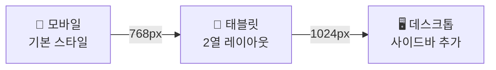

# 제4장: CSS 레이아웃과 반응형 디자인

---

## 학습 목표

이 장을 마치면 다음을 수행할 수 있다:
- CSS 선택자의 종류와 우선순위 규칙을 이해하고 적용할 수 있다
- 박스 모델을 이해하고 요소의 크기를 정확히 제어할 수 있다
- Flexbox를 사용하여 1차원 레이아웃을 구현할 수 있다
- CSS Grid를 사용하여 2차원 레이아웃을 구현할 수 있다
- 미디어 쿼리를 활용하여 반응형 웹사이트를 만들 수 있다

---

## 4.1 CSS 선택자와 우선순위

### CSS란 무엇인가?

**CSS**(Cascading Style Sheets)는 HTML 요소의 시각적 표현을 정의하는 언어이다. HTML이 문서의 구조와 의미를 담당한다면, CSS는 색상, 크기, 배치 등 디자인을 담당한다.

CSS 규칙은 선택자(selector)와 선언(declaration)으로 구성된다.

```css
/* 선택자 { 속성: 값; } */
h1 {
    color: blue;
    font-size: 2rem;
}
```

### 선택자의 종류

**표 4.1** CSS 선택자 종류와 우선순위

| 선택자 유형 | 예시 | 우선순위 | 설명 |
|------------|------|---------|------|
| 인라인 스타일 | `style="..."` | 1,0,0,0 | HTML 요소에 직접 |
| ID | `#header` | 0,1,0,0 | 고유 식별자 |
| 클래스 | `.nav` | 0,0,1,0 | 재사용 가능한 그룹 |
| 속성 | `[type="text"]` | 0,0,1,0 | 속성값 기준 |
| 가상 클래스 | `:hover` | 0,0,1,0 | 상태 기준 |
| 요소 | `div` | 0,0,0,1 | HTML 태그 |
| 가상 요소 | `::before` | 0,0,0,1 | 가상 콘텐츠 |
| 전역 | `*` | 0,0,0,0 | 모든 요소 |

**클래스 선택자**는 가장 자주 사용된다. 재사용 가능하고 우선순위가 적당하기 때문이다.

```css
.button { background: blue; }
.button-primary { background: green; }
```

**결합자**를 사용하면 더 구체적인 선택이 가능하다.

```css
/* 자손 선택자 (공백) */
.nav a { color: white; }

/* 자식 선택자 (>) */
.nav > li { margin: 0; }

/* 인접 형제 선택자 (+) */
h2 + p { margin-top: 0; }
```

### 우선순위(Specificity) 규칙

여러 규칙이 같은 요소에 적용될 때, 브라우저는 우선순위가 높은 규칙을 적용한다.

**규칙 1: 높은 레벨이 항상 이긴다**

ID 선택자 1개는 클래스 1000개보다 우선순위가 높다.

```css
/* 우선순위: 0,0,1,0 (클래스 1개) */
.title { color: blue; }

/* 우선순위: 0,1,0,0 (ID 1개) - 이것이 적용됨 */
#main-title { color: red; }
```

**규칙 2: 같은 우선순위면 나중 것이 적용**

```css
.button { color: blue; }
.button { color: red; }  /* 이것이 적용됨 */
```

**규칙 3: !important는 최후의 수단**

`!important`는 모든 우선순위를 무시한다. 하지만 유지보수가 어려워지므로 가급적 사용하지 않는다.

```css
.button {
    color: blue !important;  /* 사용 자제 */
}
```

---

## 4.2 박스 모델의 이해

### 모든 요소는 박스이다

HTML의 모든 요소는 사각형 박스로 표현된다. CSS 박스 모델은 이 박스의 구조를 정의한다.

```
+------------------------------------------+
|               margin (여백)               |
|  +------------------------------------+  |
|  |           border (테두리)           |  |
|  |  +------------------------------+  |  |
|  |  |       padding (안쪽 여백)      |  |  |
|  |  |  +-----------------------+   |  |  |
|  |  |  |    content (내용)     |   |  |  |
|  |  |  +-----------------------+   |  |  |
|  |  +------------------------------+  |  |
|  +------------------------------------+  |
+------------------------------------------+
```

**그림 4.1** CSS 박스 모델

### 박스 모델 구성 요소

- **content**: 실제 콘텐츠가 표시되는 영역
- **padding**: 콘텐츠와 테두리 사이의 안쪽 여백
- **border**: 요소의 테두리
- **margin**: 요소 바깥의 여백 (다른 요소와의 간격)

```css
.box {
    width: 200px;
    padding: 20px;
    border: 5px solid black;
    margin: 10px;
}
```

### box-sizing 속성

기본값인 `content-box`에서는 width가 콘텐츠 너비만 의미한다. padding과 border가 추가되면 실제 크기가 더 커진다.

```css
/* content-box (기본값) */
.box {
    width: 200px;
    padding: 20px;
    border: 5px solid black;
    /* 실제 너비: 200 + 20*2 + 5*2 = 250px */
}
```

`border-box`를 사용하면 width가 border까지 포함한 전체 너비를 의미한다. 크기 계산이 훨씬 직관적이다.

```css
/* border-box (권장) */
.box {
    box-sizing: border-box;
    width: 200px;
    padding: 20px;
    border: 5px solid black;
    /* 실제 너비: 정확히 200px */
}
```

**전역 설정 패턴** (거의 모든 프로젝트에서 사용)

```css
*, *::before, *::after {
    box-sizing: border-box;
}
```

---

## 4.3 Flexbox 레이아웃

### Flexbox를 왜 사용하는가?

**Flexbox**(Flexible Box)는 1차원 레이아웃 시스템이다. 행 또는 열 방향으로 요소를 유연하게 배치할 수 있다. 수직 중앙 정렬, 동적 크기 분배 등 과거에 어려웠던 레이아웃을 쉽게 구현할 수 있다.

### 4.3.1 flex container와 flex item

Flexbox는 컨테이너와 아이템으로 구성된다.

```html
<div class="container">  <!-- flex container -->
    <div class="item">1</div>  <!-- flex item -->
    <div class="item">2</div>
    <div class="item">3</div>
</div>
```

```css
.container {
    display: flex;  /* Flexbox 활성화 */
}
```

**flex-direction**: 주축 방향 설정

```css
.container {
    flex-direction: row;         /* 가로 (기본값) */
    flex-direction: row-reverse; /* 가로 역순 */
    flex-direction: column;      /* 세로 */
    flex-direction: column-reverse; /* 세로 역순 */
}
```

**flex-wrap**: 줄바꿈 설정

```css
.container {
    flex-wrap: nowrap;  /* 한 줄 (기본값) */
    flex-wrap: wrap;    /* 넘치면 줄바꿈 */
}
```

### 4.3.2 주축과 교차축 정렬

Flexbox에는 두 개의 축이 있다.
- **주축**(Main Axis): flex-direction 방향
- **교차축**(Cross Axis): 주축에 수직인 방향

```
flex-direction: row 일 때

주축 →  ←───────────────────────→
        ┌─────┐ ┌─────┐ ┌─────┐
교      │  1  │ │  2  │ │  3  │
차  ↓   └─────┘ └─────┘ └─────┘
축
```

**그림 4.2** Flexbox 주축과 교차축

**justify-content**: 주축 정렬

```css
.container {
    justify-content: flex-start;    /* 시작점 (기본값) */
    justify-content: flex-end;      /* 끝점 */
    justify-content: center;        /* 중앙 */
    justify-content: space-between; /* 양끝 정렬, 사이 균등 */
    justify-content: space-around;  /* 아이템 주변 균등 */
    justify-content: space-evenly;  /* 모든 간격 균등 */
}
```

**align-items**: 교차축 정렬

```css
.container {
    align-items: stretch;    /* 늘림 (기본값) */
    align-items: flex-start; /* 시작점 */
    align-items: flex-end;   /* 끝점 */
    align-items: center;     /* 중앙 */
    align-items: baseline;   /* 텍스트 기준선 */
}
```

**gap**: 아이템 간격

```css
.container {
    gap: 1rem;           /* 모든 방향 */
    gap: 1rem 2rem;      /* 행 열 */
    row-gap: 1rem;       /* 행 간격만 */
    column-gap: 2rem;    /* 열 간격만 */
}
```

**완벽한 중앙 정렬**

```css
.container {
    display: flex;
    justify-content: center;  /* 수평 중앙 */
    align-items: center;      /* 수직 중앙 */
}
```

### 4.3.3 실전 패턴

**패턴 1: 내비게이션 바**

```css
.navbar {
    display: flex;
    justify-content: space-between;  /* 로고와 메뉴 양끝 */
    align-items: center;
    padding: 1rem 2rem;
}

.navbar-menu {
    display: flex;
    gap: 1.5rem;
}
```

**패턴 2: 카드 리스트**

```css
.card-list {
    display: flex;
    flex-wrap: wrap;       /* 넘치면 줄바꿈 */
    gap: 1.5rem;
}

.card {
    flex: 1 1 300px;       /* 최소 300px, 균등 분배 */
    max-width: 400px;
}
```

**표 4.2** Flexbox 주요 속성 정리

| 속성 | 적용 대상 | 주요 값 |
|------|----------|--------|
| display | container | flex |
| flex-direction | container | row, column |
| flex-wrap | container | nowrap, wrap |
| justify-content | container | flex-start, center, space-between |
| align-items | container | stretch, center, flex-start |
| gap | container | 크기 값 |
| flex | item | grow shrink basis |
| align-self | item | auto, center, stretch |

_전체 패턴은 practice/chapter4/code/4-3-flexbox-examples.css 참고_

---

## 4.4 Grid 레이아웃

### Grid vs Flexbox: 언제 무엇을?

**CSS Grid**는 2차원 레이아웃 시스템이다. 행과 열을 동시에 제어할 수 있어 복잡한 레이아웃에 적합하다.

| 상황 | 추천 |
|------|------|
| 1차원 (행 또는 열) | Flexbox |
| 2차원 (행과 열) | Grid |
| 컴포넌트 내부 정렬 | Flexbox |
| 페이지 전체 레이아웃 | Grid |

쉽게 말해서, Flexbox는 "한 줄에 아이템 배치", Grid는 "격자에 아이템 배치"이다.

### 4.4.1 grid-template 정의

```css
.container {
    display: grid;
    grid-template-columns: 200px 1fr 200px;  /* 3열 */
    grid-template-rows: 100px auto 100px;    /* 3행 */
    gap: 1rem;
}
```

**fr 단위**: 남은 공간을 비율로 분배

```css
.container {
    grid-template-columns: 1fr 2fr 1fr;  /* 1:2:1 비율 */
}
```

**repeat() 함수**: 반복 패턴 간결하게

```css
.container {
    grid-template-columns: repeat(3, 1fr);  /* 3등분 */
    grid-template-columns: repeat(4, 100px);  /* 100px 4개 */
}
```

**minmax() 함수**: 최소/최대 크기 설정

```css
.container {
    grid-template-columns: repeat(auto-fit, minmax(250px, 1fr));
}
```

이 한 줄로 미디어 쿼리 없이 반응형 그리드를 만들 수 있다. 화면이 넓으면 여러 열, 좁으면 한 열로 자동 조절된다.

### 4.4.2 영역 배치와 gap

**grid-template-areas**: 영역 이름으로 배치

```css
.container {
    display: grid;
    grid-template-areas:
        "header header header"
        "sidebar main main"
        "footer footer footer";
    grid-template-columns: 200px 1fr 1fr;
}

.header  { grid-area: header; }
.sidebar { grid-area: sidebar; }
.main    { grid-area: main; }
.footer  { grid-area: footer; }
```

**그림 4.3** Grid 영역 배치 예시

```
+--------+--------+--------+
|       header              |
+--------+--------+--------+
|sidebar |      main        |
+--------+--------+--------+
|       footer              |
+--------+--------+--------+
```

**라인 번호로 배치**

```css
.item {
    grid-column: 1 / 3;  /* 1번~3번 라인 (2칸) */
    grid-row: 1 / 2;     /* 1번~2번 라인 (1칸) */
}

/* 단축 */
.item {
    grid-column: span 2;  /* 2칸 차지 */
}
```

### 4.4.3 실전 패턴: 대시보드 레이아웃

```css
.dashboard {
    display: grid;
    grid-template-columns: 250px 1fr;
    grid-template-rows: 60px 1fr;
    grid-template-areas:
        "sidebar header"
        "sidebar main";
    min-height: 100vh;
}

.dashboard-header  { grid-area: header; }
.dashboard-sidebar { grid-area: sidebar; }
.dashboard-main    { grid-area: main; }

/* 대시보드 내 카드들 */
.dashboard-cards {
    display: grid;
    grid-template-columns: repeat(auto-fit, minmax(200px, 1fr));
    gap: 1.5rem;
}
```

**표 4.3** Grid 주요 속성 정리

| 속성 | 적용 대상 | 설명 |
|------|----------|------|
| display: grid | container | Grid 활성화 |
| grid-template-columns | container | 열 정의 |
| grid-template-rows | container | 행 정의 |
| grid-template-areas | container | 영역 이름 정의 |
| gap | container | 셀 간격 |
| grid-column | item | 열 위치 |
| grid-row | item | 행 위치 |
| grid-area | item | 영역 이름 참조 |

_전체 패턴은 practice/chapter4/code/4-4-grid-examples.css 참고_

---

## 4.5 반응형 디자인

### 반응형 디자인이란?

**반응형 디자인**(Responsive Design)은 화면 크기에 따라 레이아웃이 유연하게 변하는 디자인 방식이다. 하나의 웹사이트가 모바일, 태블릿, 데스크톱 모두에서 잘 보이도록 한다.

2025년 현재 웹 트래픽의 70% 이상이 모바일에서 발생한다. 반응형 디자인은 선택이 아닌 필수이다.

### 4.5.1 미디어 쿼리 기초

**미디어 쿼리**(Media Query)는 화면 조건에 따라 다른 CSS를 적용하는 기능이다.

```css
/* 기본 스타일 */
.container {
    width: 100%;
}

/* 화면 너비가 768px 이상일 때 */
@media (min-width: 768px) {
    .container {
        width: 750px;
    }
}

/* 화면 너비가 1024px 이상일 때 */
@media (min-width: 1024px) {
    .container {
        width: 970px;
    }
}
```

### 4.5.2 모바일 퍼스트 접근법

**모바일 퍼스트**(Mobile First)는 가장 작은 화면부터 디자인하고 점점 큰 화면으로 확장하는 방식이다.

**왜 모바일 퍼스트인가?**

1. **사용자 비중**: 모바일 사용자가 가장 많다
2. **성능**: 모바일에서 불필요한 CSS를 로드하지 않는다
3. **SEO**: Google은 모바일 버전을 기준으로 순위를 매긴다
4. **점진적 향상**: 기본 기능부터 추가 기능으로 확장

**min-width vs max-width**

```css
/* 모바일 퍼스트 (권장) */
.box { width: 100%; }           /* 모바일 기본 */

@media (min-width: 768px) {     /* 태블릿 이상 */
    .box { width: 50%; }
}

/* 데스크톱 퍼스트 (비권장) */
.box { width: 50%; }            /* 데스크톱 기본 */

@media (max-width: 767px) {     /* 모바일 */
    .box { width: 100%; }
}
```

**표 4.4** 권장 브레이크포인트 (2025)

| 기기 | 브레이크포인트 | 미디어 쿼리 |
|------|--------------|------------|
| 모바일 | 기본 | (미디어 쿼리 없음) |
| 태블릿 | 768px | @media (min-width: 768px) |
| 데스크톱 | 1024px | @media (min-width: 1024px) |
| 대형 화면 | 1200px | @media (min-width: 1200px) |

### 4.5.3 반응형 이미지와 타이포그래피

**반응형 이미지**

```css
img {
    max-width: 100%;  /* 컨테이너를 넘지 않음 */
    height: auto;     /* 비율 유지 */
}
```

**반응형 타이포그래피**

```css
/* clamp(): 최소, 선호, 최대 */
h1 {
    font-size: clamp(1.5rem, 4vw, 3rem);
}

/* vw 단위 활용 */
.hero-title {
    font-size: calc(1rem + 2vw);
}
```



**그림 4.4** 모바일 퍼스트 반응형 흐름

---

## 4.6 실습: 게시판 UI 스타일링

### 실습 목표

3장에서 만든 시맨틱 게시판 마크업에 CSS를 적용하여 완성된 UI를 만든다.

### 적용할 기술

- **Flexbox**: 헤더, 내비게이션, 카드 내부
- **Grid**: 페이지 전체 레이아웃 (main + aside)
- **미디어 쿼리**: 모바일/태블릿/데스크톱 대응

### 핵심 구조

```css
/* 페이지 레이아웃 (Grid) */
.page-layout {
    display: grid;
    grid-template-columns: 1fr;      /* 모바일: 1열 */
    gap: 2rem;
}

@media (min-width: 768px) {
    .page-layout {
        grid-template-columns: 1fr 280px;  /* 태블릿+: 메인 + 사이드 */
    }
}

/* 내비게이션 (Flexbox) */
nav ul {
    display: flex;
    justify-content: center;
    gap: 0;
}

/* 사이드바 섹션들 (Flexbox) */
aside {
    display: flex;
    flex-direction: column;
    gap: 1.5rem;
}
```

### 반응형 처리

```css
/* 모바일 */
@media (max-width: 767px) {
    nav ul {
        flex-direction: column;  /* 세로 메뉴 */
    }

    aside {
        order: 2;  /* 사이드바를 아래로 */
    }
}
```

_전체 코드는 practice/chapter4/code/4-6-board-styles.css 참고_

---

## 핵심 정리

이 장에서 다룬 핵심 내용을 정리하면 다음과 같다:

- **선택자와 우선순위**: ID > 클래스 > 요소, 같으면 나중 것 적용
- **박스 모델**: content + padding + border + margin, border-box 권장
- **Flexbox**: 1차원 레이아웃, justify-content(주축), align-items(교차축)
- **Grid**: 2차원 레이아웃, grid-template-columns/rows/areas
- **반응형**: 모바일 퍼스트, min-width 미디어 쿼리
- **실전**: Flexbox + Grid 조합으로 복잡한 레이아웃 구현

---

## 연습문제

### 기초

**1.** 다음 선택자들의 우선순위를 계산하고 순서대로 나열하시오.
```css
#header .nav a
.nav-link
header nav a
#main
```

**2.** `box-sizing: content-box`와 `box-sizing: border-box`의 차이를 설명하시오.

**3.** Flexbox와 Grid 중 어떤 것을 사용해야 하는지 판단하는 기준을 설명하시오.

### 중급

**4.** Flexbox를 사용하여 다음 요구사항의 내비게이션을 구현하시오.
   - 로고는 왼쪽, 메뉴는 오른쪽
   - 메뉴 간격 1.5rem
   - 수직 중앙 정렬

**5.** CSS Grid를 사용하여 4열 카드 레이아웃을 구현하시오.
   - 최소 너비 250px
   - 화면이 좁으면 자동으로 열 수 감소
   - 미디어 쿼리 없이 구현

**6.** 다음 CSS를 모바일 퍼스트 방식으로 변환하시오.
```css
.container { width: 1200px; }

@media (max-width: 1024px) {
    .container { width: 960px; }
}

@media (max-width: 768px) {
    .container { width: 100%; }
}
```

### 심화

**7.** 다음 요구사항을 충족하는 반응형 대시보드를 구현하시오.
   - 사이드바(250px) + 메인 영역
   - 메인 영역에 카드 그리드 (auto-fit)
   - 모바일에서 사이드바는 상단으로 이동
   - 태블릿에서 사이드바 200px
   - 완성된 코드와 각 브레이크포인트 스크린샷 제출

---

## 다음 장 예고

다음 장에서는 JavaScript 핵심을 배운다. 변수, 함수, 배열 메서드부터 DOM 조작, 비동기 프로그래밍까지 프론트엔드 개발에 필요한 JavaScript 기초를 다룬다. 이 장에서 만든 게시판 UI에 동적 기능을 추가할 준비를 한다.

---

## 참고문헌

1. MDN Web Docs. (2025). CSS reference. https://developer.mozilla.org/en-US/docs/Web/CSS
2. CSS-Tricks. (2025). A Complete Guide to Flexbox. https://css-tricks.com/snippets/css/a-guide-to-flexbox/
3. CSS-Tricks. (2025). A Complete Guide to CSS Grid. https://css-tricks.com/snippets/css/complete-guide-grid/
4. web.dev. (2025). Responsive Web Design Basics. https://web.dev/responsive-web-design-basics/
5. BrowserStack. (2025). Responsive Design Breakpoints. https://www.browserstack.com/guide/responsive-design-breakpoints
